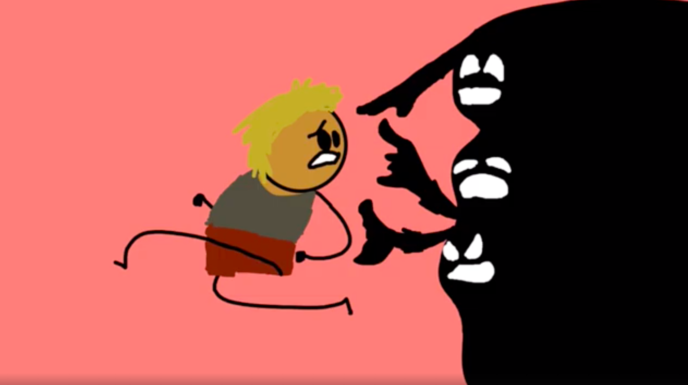
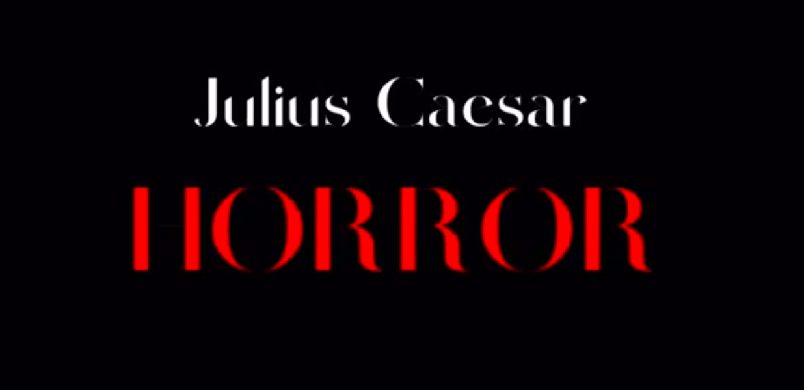
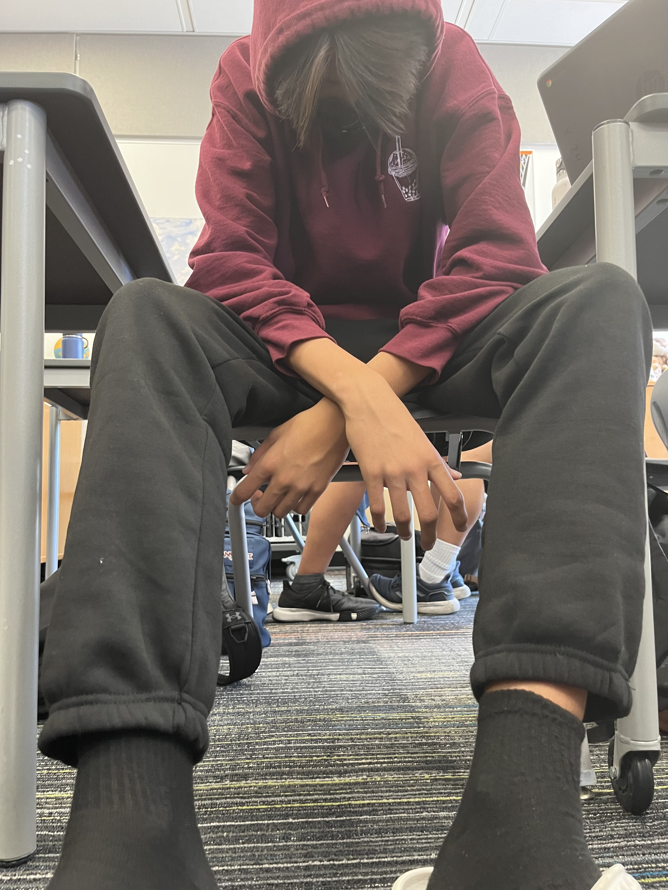
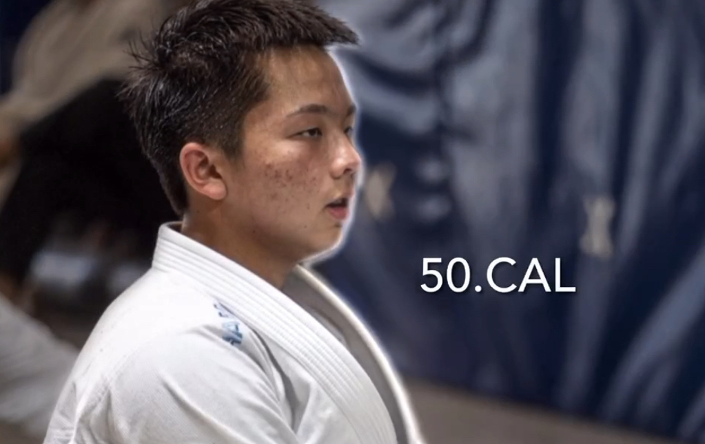

# ScronkEdits
Editing by Robin
## Who Is Scronk?
 Scronk, otherwise known as Robin Baltazar, is an up-an-coming editor on the scene. Learn more about who he is by following his [Instagram](www.instagram.com/sxronck/)     
              
 
## The Inspiration
 Forced to edit videos for school projects, Robin quickly picked up the basics of editing and video making, and began to grow his skills over time. Later motivated by other sick and cool edits on Instagram, Tiktok, and Youtube, Robin was determined to make his own edits, mostly based on his friends.
## The Method
 Over time, Robin has crafted a general beginner's roadmap into the schematics of editing, differing for each style of video. The most important thing is to have fun, and learn from your mistakes to continue to improve over time.
#### School Projects, Longer Videos, Informative Videos, etc.
 1. Curate your clips. You simply cannot begin editing without first gathering what you want to say.
 2. Place images or graphics over your clips to attract and keep attention.
 3. Use music and sounds to create a tone for your video.
#### Narrative Videos, Short Movies, Skits, etc.
 1. (Optional) Making a script can really help with the organization and planning of the video
 2. Create your clips with the video in mind. Editing is easier when you know what you plan to make.
 3. Make use of clever transitions to make your video flow better.
 4. Make sure the audio and video quality are acceptable. People do not want to watch a video with poor audio.
 5. Music and sound effects are even more important in these works to create tone and keep viewer attention
#### Short Social Media Style Edits
1. Select the song you will use first. Making the edit with the music is very important for making an aesthetically appealing video.
2. Collect clips with impact, and collect alot of clips.
3. Make use of transitions and effects to add even more pizazz to your video.
## The Results
Some edits not included due to school guidelines.
#### Lord of the Flies English School Project
Made in October of 2022. Not my first video made for school, but probably my first one that a considerable effort was placed into. No music due to time constraints at the time.
         

#### Julius Caesar English School Project
Made in January of 2023. Narrative Video, one of my favorites to edit and make.

#### Brandon Wong Short Edit
Made in November of 2022. My first experiment with a short-style edit of my good friend Brandon. Not very good, but I was able to gain experience and knowledge from crafting it.

#### Calvin Lee Short Edit
Made in September of 2023. My most recent edit of my friend Calvin Lee. Much better than my previous edits, but could still be polished.

 
